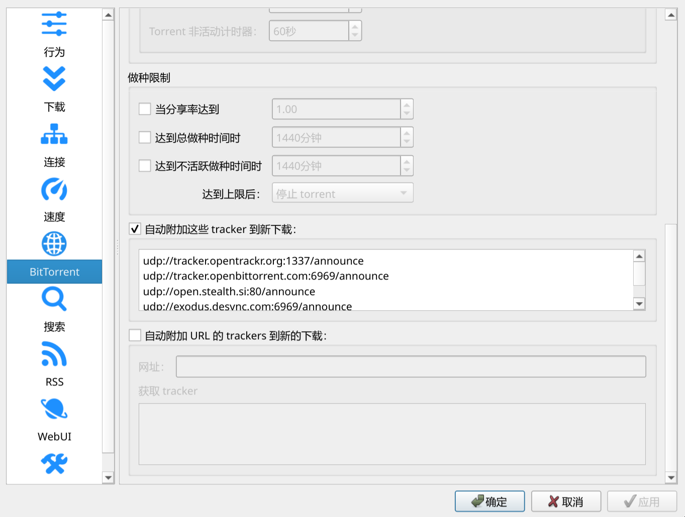

**该仓库是nixos-unstable的配置，且是一个去flake的配置，主要用于给自己备份。但是对于qemu/KVM虚拟机包含了一些补丁，有需要的可以借用**

_如果需要，请将 `<yourpassword>` 更换为你的密码，`<yourusername>` 更换为你的用户名之后再 `rebuild`，可以直接 `cd BaizhuNix`到仓库中后运行_
```
# 运行前先解压 7z 压缩包到该文件夹内

find . -path "./.git" -prune -o -type f -name "*" -exec sed -i 's/<yourusername>/你的用户名/g' {} +

find . -path "./.git" -prune -o -type f -name "*" -exec sed -i 's/<yourpassword>/你的密码/g' {} +
```

# Features
- 纯 `configuration.nix` 和 `home.nix`，无flake；
- 包括 `Virt_manager` 和 `qemu/KVM` 在内的许多软件的补丁；
- `noctalia` 和 `dms` 主题色同步；
- 歌词显示脚本；
- `conda` 环境中部署 `TTS` 和 `latexocr`；
- 双系统的一些修复；
- `plasma` 和 `niri` 双桌面环境；
- `rm` 命令保护，运行 `rm` 时只有输入 `yes` 才会成功运行，而 `remove-without-permission` 命令依然是原味 `rm`。
- 在 `dolphin` 中右键可使用 `unar` 预览和解压压缩包。
- `OpenCode` 和 `cc-connect` 支持。
- 鼠标拖尾特效支持，[见我另一仓库](https://github.com/baizhu945/niri-mouse-trail) 。

# 一、安装home-manager
```
nix-channel --add https://github.com/nix-community/home-manager/archive/master.tar.gz home-manager

nix-channel --update

nix-shell '<home-manager>' -A install

nix-channel --add https://nixos.org/channels/nixpkgs-unstable

nix-channel --update
```

# 二、改nix-unstable（如果最初安装的是稳定版而不是unstable版）
```
sudo nix-channel --remove nixos

sudo nix-channel --add https://channels.nixos.org/nixos-unstable nixos

sudo nix-channel --update
```

# 三、使用conda安装一些工具

## 在conda中安装`pix2tex`
```
conda-shell # 进入conda环境

conda create -n latexocr # 创建环境
```
然后按照 https://github.com/lukas-blecher/LaTeX-OCR 进行安装

# 四、noctalia 和 DankMaterialShell 配置
将 7z 文件解压后，将 `noctalia` 和 `DankMaterialShell` 文件夹复制到 `~/.config/` 路径下。

_别忘了将 `<yourpassword>` 更换为你的密码，`<yourusername>` 更换为你的用户名_

# 五、Joplin配置
安装插件 `Katex Input Helper`, `Record`, `Rich Markdown`, `Search & Replace`, `Kity Minder`, `Note Tabs`

# 六、Qbittorrent配置


在上图处加上以下网址以启用 `no tracker` 下载：
```
udp://tracker.opentrackr.org:1337/announce
udp://tracker.openbittorrent.com:6969/announce
udp://open.stealth.si:80/announce
udp://exodus.desync.com:6969/announce
http://tracker.bt4g.com:2095/announce
udp://tracker.torrent.eu.org:451/announce
```

# 七、`cc-connect` 配置
在 `~/.cc-connect` 下放置如下 `config.toml` 文件
```
# cc-connect configuration
# Docs: https://github.com/chenhg5/cc-connect

language = "zh"

[display]
mode = "full"

thinking_messages = true

tool_messages = true

[log]
level = "debug"

[[projects]]
name = "opencode"

[projects.agent]
type = "opencode"   # "claudecode", "codex", "cursor", "gemini", "qoder", "opencode", or "iflow"

[projects.agent.options]
work_dir = "/home/<yourusername>"
mode = "auto"
# model = "claude-sonnet-4-20250514"

# --- Choose at least one platform below ---

# Feishu / Lark (WebSocket, no public IP needed)

model = "deepseek/deepseek-v4-pro"

[[projects.platforms]]
type = "telegram"

[projects.platforms.options]
token = "xxx"
allow_from  = [xxx]
admin_from  = [xxx]

[[projects.platforms]]
type = "feishu"

[projects.platforms.options]
app_id = "xxx"
app_secret = "xxx"

[[projects.platforms]]
type = "discord"

[projects.platforms.options]
token = "xxx"
```

# 八、Trouble shooting
## Windows 时间错乱
参考 https://wiki.archlinux.org/title/System_time#UTC_in_Microsoft_Windows

## 关闭微软万恶的快速启动
进入 `控制面板` -> `电源选项` -> `选择电源按钮的功能`

## 每次从 Windows 关机后， BIOS 启动顺序被万恶的微软篡改
使用 `efibootmgr` 获取 Windows 启动的编号，然后运行
```
sudo efibootmgr -b 0002 --inactive # 把 0002 更换为 Windows 的编号
```
若没有生效，则找到挂载到 `NixOS` 的 `Windows` 启动分区 `/mnt/Windows/EFI/EFI/Microsoft/Boot/`，然后
```
# 将原来的文件备份
sudo mv /mnt/Windows/EFI/EFI/Microsoft/Boot/bootmgr.efi /mnt/Windows/EFI/EFI/Microsoft/Boot/bootmgr.efi.bak

# 替换为 Grub 的文件
sudo cp /boot/EFI/NixOS-boot/grubx64.efi /mnt/Windows/EFI/EFI/Microsoft/Boot/bootmgr.efi
```

## 在 `Linux` 侧使用 `wine` 运行 `Windows` 游戏无法读取 `Windows` 的存档
使用 `nixos/automount.nix` 配置自动挂载 `Windows` 的磁盘，将 `C` 盘符下的 `ProgramData` 和 `Users` 软链接到 `~/.wine/drive_c` 路径下，替换原来的两个文件夹。

## Virt-manager 没有自动创建 `default` 网络
```
sudo virsh net-define /var/lib/libvirt/qemu/networks/default.xml

sudo virsh net-create /var/lib/libvirt/qemu/networks/default.xml

sudo virsh net-autostart default
```

## noctalia插件列表无法刷新
```
git clone https://github.com/noctalia-dev/legacy-v4-plugins

node legacy-v4-plugins/registry.json
```

## onlyoffice不识别系统安装的中文字体
`/nix/store`后面的哈希值路径会随着版本变化，需要在自己的系统中查找，与下面的不一定一样
```
mkdir -p ~/.local/share/fonts

sudo cp /nix/store/lq0h9dp1capyrlgis2gz5qxsvw211244-corefonts-1/share/fonts/truetype/* ~/.local/share/fonts/

sudo cp /nix/store/8rxvh1p7jpjxkv23jj246j7xm0ff6ps0-vista-fonts-1/share/fonts/truetype/* ~/.local/share/fonts/

sudo cp /nix/store/ii65s09vhczsslbdbdikfibfh6bnnf6s-vista-fonts-chs-1/share/fonts/truetype/* ~/.local/share/fonts/

sudo cp /nix/store/m67c7fna8xjvf6qq8l0g4hn4y7smr6qc-vista-fonts-cht-1/share/fonts/truetype/* ~/.local/share/fonts/

sudo fc-cache -fv
```
若还有windows系统，则可以复制windows系统的字体到`~/.local/share/fonts/`中，然后运行`rm ~/.local/share/fonts/*.fon`

# 九、Known BUGs
## Screen Recording
在`niri`中，`noctalia`的屏幕录像不完全可用，`obs`的`Wayland output(dmabuf)`不可用，`Wayland output(scpy)`可用但是要设置 `Flip red and blue`

## Nix Cache Cleaning
禁止运行 `sudo nh clean all` 命令，这会将 `home-manager` 破坏掉。
